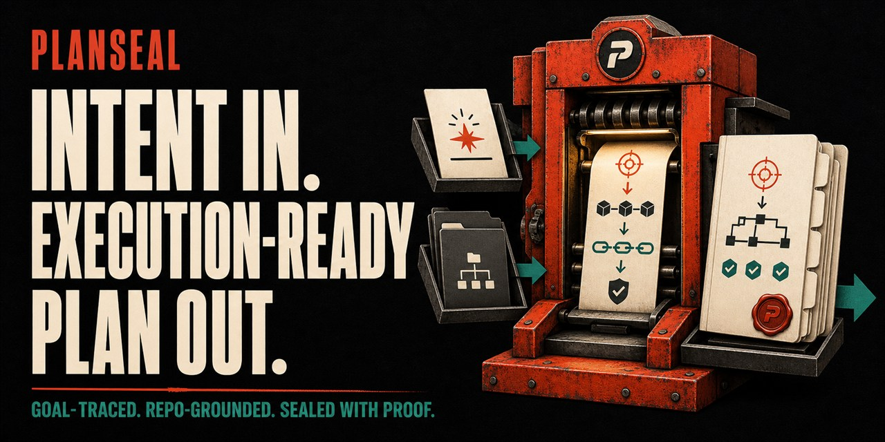

<p align="center">
  
</p>

<p align="center">
  PlanSeal 將 intent 與 repo reality 建構成一份 goal-traced、evidence-grounded、可由下一個 coding agent 直接執行的 canonical plan；在完成證據閉合前，不會假裝它已經 `Ready`。
</p>

<p align="center">
  <a href="https://github.com/cablate/planseal/releases/latest"></a>
  <a href="https://github.com/cablate/planseal/stargazers"></a>
  <a href="LICENSE"></a>
</p>

<p align="center">
  <a href="README.md">English</a> · <strong>繁體中文</strong>
</p>

<p align="center">
  <a href="#快速開始">快速開始</a> ·
  <a href="#一份-sealed-plan-包含什麼">輸出契約</a> ·
  <a href="#核心運作方式">運作方式</a> ·
  <a href="#安裝">安裝</a> ·
  <a href="docs/TRUST.md">信任與安全</a>
</p>

| Goal-traced | Evidence-grounded | Verdict-gated |
|---|---|---|
| 每項 requirement、package 與 check 都透過必要 GORE 連回 actor outcome。 | Requirement、repo Fact、Decision、Inference、Assumption 與 Unknown 不會混成一團。 | 每份計畫明確結束為 `Ready`、`Needs Revision` 或 `Not Executable`，不使用模糊信心。 |

> Plan 不是因為寫得很詳細就算 sealed。只有當 goal、decision、dependency、recovery path 與 completion evidence 都能閉合，才算準備好交付執行。

**可以獨立使用。** Spectra、OpenSpec、Baton、subagent 與特定模型都能補強，但沒有任何一項是必要依賴。

## 快速開始

在 Agent harness 使用的 skill 目錄中安裝固定版本：

```bash
git clone --branch v0.1.0 --depth 1 https://github.com/cablate/planseal.git planseal
```

接著要求建立計畫：

```text
使用 $planseal 檢查目前 repo，為 organization-scoped API keys
建立一份可執行 implementation plan。不要實作 code。
```

PlanSeal 會選擇最小充分 profile、查證 current state、將 goals 追溯到 work packages 與 evidence，最後回傳一份 canonical plan 與 readiness verdict。

## 一份 sealed plan 包含什麼

```text
可觀察 outcome + scope + non-goals
└── GORE：actor/job → product intent → goals
    └── requirements + invariants
        └── verified current state → target behavior
            └── dependency-aware work packages
                └── validation + rollback + cleanup
                    └── traceability + readiness verdict
```

它是一份 executor-independent implementation contract，不是 task dump、planner transcript，也不是第二套規格系統。

## Task list 不等於可執行計畫

許多 AI 產生的 plan 看起來很完整，實際執行時卻仍要臨場發明：

- 技術需求背後真正的使用者或營運成果；
- 哪些 repo 敘述是已驗證 Fact，哪些只是 Assumption；
- target behavior、public contract 與必須保留的 invariant；
- package dependency、平行邊界與集中整合點；
- failure、rollback、migration、cleanup 與 handoff；
- 哪些 evidence 能證明成果，而不只是證明 code 可以編譯。

PlanSeal 將 plan 視為 **executor-independent contract**，不是 planner 推理過程的逐字稿。只有當 material goals、decisions、unknowns、dependencies 與 evidence 都足以讓實作者直接開始，才會判定為 Ready。

## 它改變了什麼

| 沒有 PlanSeal | 使用 PlanSeal |
|---|---|
| 把技術動作當作目標 | 由 actor outcome 與 product intent 帶領技術工作 |
| Requirement、Fact、Inference 與 Assumption 混在一起 | 證據分類，並連到穩定 repo anchor |
| 用檔案清單假裝是 implementation design | 說明 baseline、target behavior、ownership、state 與 failure path |
| 依照文字直覺排序 task | 建立有 artifact 與 integration owner 的 dependency DAG |
| Unknown 藏到 implementation 中途 | 提前轉成 decision、spike 或 preflight gate |
| Build／typecheck 通過就宣稱完成 | 每個驗證都說明證明哪個 claim 與 outcome |
| Review 另外產生一份問題報告 | 把 repair 整合回同一份 canonical plan |
| 每份 plan 都自稱可執行 | 明確判定 `Ready`、`Needs Revision` 或 `Not Executable` |

## 核心運作方式

PlanSeal 要求七種必要成果，但不強迫 Agent 機械執行固定步驟：

1. **Identity and outcome**：可觀察成果、scope、non-goals、invariants、owner、repo snapshot 與 freshness。
2. **Mandatory GORE core**：actor／job、product intent、primary／supporting goals、quality guardrails、domain invariants 與 operationalization。
3. **Grounded current state**：分開 Requirement、Fact、Decision、Inference、Assumption 與 Unknown。
4. **Target behavior and design**：entrypoint、input、state、output、side effect、failure、recovery、ownership、compatibility 與 forbidden shortcut。
5. **Executable work graph**：可獨立驗收的 packages、dependency DAG、scope anchors、handoff、rollback 與 Done When。
6. **Triggered coverage and release path**：只有被觸發時才展開 security、data、UI、operations、migration、rollout、cutover、cleanup 與 deferred verification。
7. **Rechecked canonical plan**：完成 forward／backward traceability 後，給出誠實 readiness verdict。

當新增資料已不會改變排序、風險、驗證、回復策略或 verdict 時，停止繼續蒐證。

## GORE 是必要核心

PlanSeal 使用 Goal-Oriented Requirements Engineering 作為計畫的 why、boundary 與 traceability 層。每一種 profile 都必須保留：

```text
actor / job
  → product intent
  → primary and supporting goals
  → requirement or invariant
  → work package
  → outcome evidence
```

GORE 不是第二份規格書，也不是為了產生儀式化圖表。Focused bug fix 可以用一列 compact chain 表達；migration 或多 owner change 才依真實 dependency 展開 goal hierarchy、conflict、continuity 與 decision ownership。

## 四種 Plan Profile

| Profile | 適用情況 | 必要深度 |
|---|---|---|
| **Focused** | 單一 bug、小型行為修正、局部設定 | Compact GORE、verified baseline／target、focused package、回歸 evidence、rollback |
| **Standard** | 一般 feature、跨檔 refactor、API 或 UI flow | GORE core、behavior contract、DAG、triggered coverage、integration 與 cleanup |
| **Migration** | Framework、platform、schema、storage、API version 或 data model 遷移 | Continuity、transition、cutover、compatibility、data movement、rollback 與 cleanup gates |
| **Master** | 多 owner、surface、workspace、release 或集中整合 | 展開 goals、ownership／conflict map、parallel／serial tracks 與 integration governance |

Profile 只控制展開深度，不決定是否需要 goal、evidence 或 readiness。

## Readiness Verdict

| Verdict | 意義 |
|---|---|
| `Ready` | Material goals、decisions 與 unknowns 已關閉；goal → requirement → package → evidence 完整，可以開始 implementation |
| `Needs Revision` | 已有 resolution path，但結果仍可能改變 target behavior、architecture、DAG、migration、release 或 acceptance |
| `Not Executable` | 缺少必要 input、authority、ownership 或 safety boundary，連可靠 resolution path 都無法開始 |

如果 discovery 結果仍可能推翻整體方向，即使 discovery task 本身可以執行，也不能把整份 plan 標為 Ready。

## 獨立使用

PlanSeal 不要求：

- Spectra、OpenSpec 或其他規格框架；
- 特定模型、agent runtime、IDE 或 orchestration system；
- subagent 或平行執行；
- planning 階段取得 repo write access。

外部 artifact 與 specialist skill 可以提供 evidence，但最後交付物仍是一份自給自足的 canonical plan。

PlanSeal 可以搭配 [Baton](https://github.com/cablate/baton)：PlanSeal 定義已準備好執行的工作；Baton 判斷是否派工以及如何派工。兩者都不互相依賴。

## 與 GPT-5.6 Guidance 的關係

PlanSeal 不綁模型，但其結構特別符合 [OpenAI GPT-5.6 prompt guidance](https://developers.openai.com/api/docs/guides/prompt-guidance-gpt-5p6) 的方向：先說明 outcome、重要 constraints、可用 evidence 與 completion bar，再讓模型選擇有效路徑。PlanSeal 將這些資訊轉成可跨 session 使用的 implementation contract。

這代表設計方向一致，不代表 OpenAI 官方背書，也不代表只能使用 GPT-5.6。

## 安裝

### 由 Agent 規劃並等待批准

```text
Read https://raw.githubusercontent.com/cablate/planseal/v0.1.0/install/AGENT-INSTALL.md
and prepare a plan to install PlanSeal as $planseal.

Inspect my current skill directories first. Do not overwrite existing files.
Show the source, destination, changed files, non-changes, and verification steps.
Wait for my approval before writing anything.
```

安裝前可先檢查 [installation manifest](install/MANIFEST.md) 與 [trust boundary](docs/TRUST.md)。

### 手動安裝

```bash
git clone --branch v0.1.0 --depth 1 https://github.com/cablate/planseal.git planseal
```

把 clone 後的資料夾放置或連結到 Agent harness 能探索 `SKILL.md` 的 skill 目錄。各產品的實際 discovery path 不同，請以當前官方文件為準。如果產品會快取 skill discovery，安裝後請開新 session，再執行 [smoke tests](install/SMOKE-TESTS.md)。

真正給 AI 載入的入口是 [SKILL.md](SKILL.md)；README、release 與 install 文件是給人閱讀，不需要進入一般 runtime context。

## 更多使用方式

審查並修復既有計畫：

```text
使用 $planseal 審查這份 migration plan。把所有 material repair
整合回一份 canonical plan，最後給出 readiness verdict。
```

執行前重驗：

```text
使用 $planseal 依目前 repo preflight 這份 plan，修復 relevant drift，
並指出第一個可以開始的 work package。
```

## 設計原則

- **規劃 outcome，不是 activity。**
- **每份計畫都保留真實 GORE chain。**
- **Evidence 必須充分、新鮮並誠實分類。**
- **只保留一份 canonical plan；外部 artifact 是 input，不是競爭的真相。**
- **Unknown 必須在 implementation 依賴它之前變成 decision、spike 或 gate。**
- **Work package 依 outcome、dependency、ownership、rollback 與 verification 切分，不依檔案數量。**
- **完成要證明 actor outcome 與 invariant，不只證明 build artifact 存在。**
- **有用的 plan 不一定 Ready；verdict 必須誠實。**

## 授權

MIT © 2026 CabLate，詳見 [LICENSE](LICENSE)。
