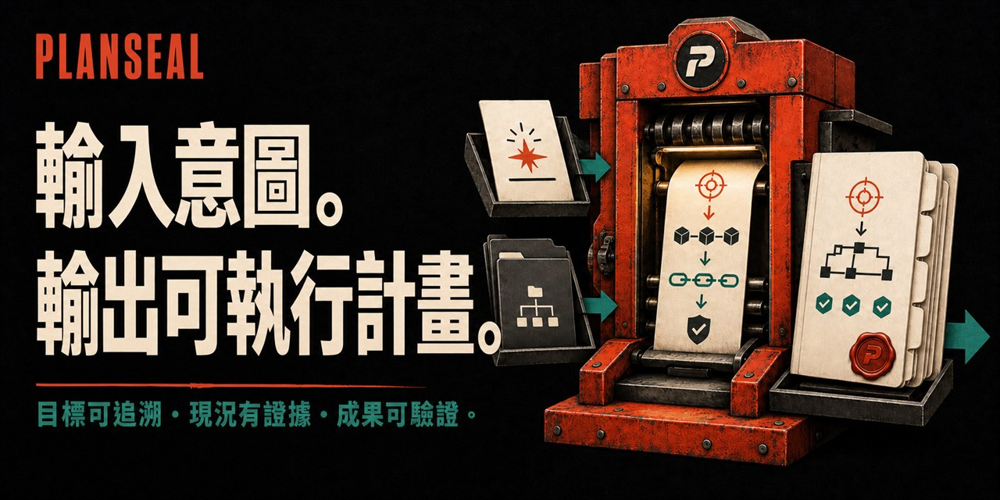

<p align="center">
  
</p>

<p align="center">
  PlanSeal 會先查證專案現況，再把「為什麼要做、要改成什麼、先做哪些工作、如何證明完成」整理成一份下一個 Agent 不必猜就能接手的技術計畫。
</p>

<p align="center">
  <a href="https://github.com/cablate/planseal/releases/latest"></a>
  <a href="https://github.com/cablate/planseal/stargazers"></a>
  <a href="LICENSE"></a>
</p>

<p align="center">
  <a href="README.md">English</a> · <strong>繁體中文</strong>
</p>

<p align="center">
  <a href="#快速開始">快速開始</a> ·
  <a href="#你會拿到什麼">計畫內容</a> ·
  <a href="#為什麼一般待辦清單不夠">為什麼需要</a> ·
  <a href="#gore-為什麼是必要的">GORE</a> ·
  <a href="#安裝-planseal">安裝</a> ·
  <a href="docs/TRUST.md">信任與安全</a>
</p>

## 快速開始

把下面這段貼給已安裝 PlanSeal 的 Agent，再把引號裡的需求換成你要做的事：

```text
請使用 $planseal 檢查目前專案，為「新增組織層級 API 金鑰」建立一份可以直接執行的技術計畫。

請先查證目前的程式碼、設定與測試，再整理：
- 這項改動要解決什麼問題，以及哪些事情不在範圍內；
- 現況與目標行為有什麼差異；
- 工作該怎麼分、先後順序與相依關係；
- 可能失敗的地方、回復方式與清理工作；
- 每一部分要用什麼證據確認完成。

查不到的地方不要猜，請標示未知事項與解決方法。
不要實作，也不要修改任何檔案。最後只交付一份主計畫，並標示目前是 `Ready`、`Needs Revision` 或 `Not Executable`。
```

還沒安裝 PlanSeal？請跳到[安裝](#安裝-planseal)。

PlanSeal 會依改動規模決定計畫需要寫多深，查證目前狀況，把目標連到工作與驗收方式，最後只交付一份可以直接接手的主計畫。

| 目標有來由 | 現況有證據 | 能不能開始有明確答案 |
|---|---|---|
| 每項工作都能說明要替誰解決什麼問題。 | 已查證事實、推論、假設與未知事項會分開寫。 | 最後一定標示 `Ready`、`Needs Revision` 或 `Not Executable`。 |

> 一份計畫寫得再長，如果執行者仍得猜目標、先後順序、失敗時怎麼退回，或怎樣才算完成，就還不能交付。

## 你會拿到什麼

一份可以直接交給下一個 Agent 的主計畫，至少包含：

```text
要帶來的結果、改動範圍與刻意不做的事
└── 誰需要這個結果，以及為什麼
    └── 必須做到的行為與不能破壞的規則
        └── 已查證的現況與預期結果
            └── 工作拆分、先後順序與負責範圍
                └── 驗證、回復與清理方式
                    └── 現在能不能開始執行
```

它不是待辦清單、Agent 的思考過程，也不是另一套規格文件。即使換人或換 Agent，也能照著同一份計畫繼續執行與驗收。

## 為什麼一般待辦清單不夠

很多 AI 產生的計畫看起來項目齊全，真正動手時，執行者仍得自己補答案：

- 這項改動到底要替誰解決什麼問題；
- 哪些現況已經查證，哪些只是推測；
- 完成後應該出現什麼行為，哪些對外介面與既有規則不能被破壞；
- 工作的先後關係，哪些能同時進行，最後由誰整合；
- 發生錯誤時怎麼回復，遷移完成後還要清掉什麼；
- 要看到哪些結果，才能證明需求真的完成。

PlanSeal 的判準很直接：下一個執行者能不能在不必自行猜測的情況下開始。如果還不行，它就不會把計畫標成 `Ready`。

## 和一般計畫有什麼不同

| 一般計畫常見問題 | PlanSeal 的處理方式 |
|---|---|
| 一開始就列要改哪些檔案 | 先說清楚要替誰帶來什麼結果 |
| 把查到的事和猜測混在一起 | 分開標示已查證事實、推論、假設與未知事項 |
| 只列工作項目，不說完成後的行為 | 寫出現況、預期結果、影響範圍與失敗處理 |
| 按文字順序排工作 | 根據真正的相依關係排序，標出能同時進行的部分 |
| 把未知問題留到開工後 | 開工前先決定、調查或明確擋下 |
| 編譯或測試通過就宣稱完成 | 驗證需求與實際使用結果是否達成 |
| 審查後另外建立修正報告 | 把修正直接合回同一份主計畫 |
| 每份計畫都說可以開始 | 明確標示現在可以開始、需要補齊，或目前無法執行 |

## GORE 為什麼是必要的

GORE 是 Goal-Oriented Requirements Engineering 的縮寫，可以理解為「從目標一路追到需求、工作與驗收」。

PlanSeal 把它設為每份計畫的必要項，目的是避免計畫只剩下「改哪些程式碼」：

```text
誰需要什麼結果
  → 這項改動要解決什麼問題
  → 必須做到的行為與不能破壞的規則
  → 哪些工作負責實現
  → 用什麼證據證明完成
```

小型修正用一列就夠。只有遷移、多人協作或跨系統改動，才需要展開目標層級、衝突、服務延續與決策責任。GORE 不是第二份規格書，也不要求為了形式製作圖表。

## 它怎麼工作

Agent 可以自行選擇調查順序；交付前，以下七項缺一不可：

1. **說清楚成果與範圍**：要達成什麼結果、哪些事情不在範圍內、哪些規則不能破壞，以及誰負責；同時記錄計畫依據的專案版本與查證時間。
2. **建立 GORE 追溯鏈**：誰需要什麼結果、這項改動為什麼存在、主要與支援目標是什麼，以及每項工作如何連回目標與不可降低的品質要求。
3. **查證目前狀況**：分開標示已查證事實、既有決定、推論、假設與未知事項。
4. **定義完成後的行為**：從哪裡進入、接受什麼、狀態如何改變、輸出什麼、會影響什麼，以及失敗時如何回復；同時說清楚負責範圍、相容性與明確禁止的捷徑。
5. **拆成可以驗收的工作**：標明每項工作對應的程式範圍、先後關係、可同時進行的部分、交接點、回復方式與完成條件。
6. **補齊真的會遇到的風險**：只有確實涉及時，才展開安全、資料、介面、維運、遷移、發布、切換、清理，以及目前無法執行、必須延後的驗證。
7. **重新檢查整份計畫**：確認能從目標一路追到工作與驗收，也能從每項工作反查它服務的目標，再判定現在能不能開始。

當新查到的資料已不會改變工作順序、風險、驗證、回復方式或最後判定時，就停止繼續調查。

## 依改動規模調整計畫深度

| 計畫深度 | 適用情況 | 會寫到什麼程度 |
|---|---|---|
| **聚焦型（Focused）** | 單一錯誤、小型行為或設定修正 | 簡短 GORE 追溯鏈、已查證現況、預期結果、回歸驗證與回復方式 |
| **標準型（Standard）** | 一般功能、跨檔案重構、API 或介面流程 | 完整行為、工作相依關係、整合責任、驗證與清理 |
| **遷移型（Migration）** | 框架、平台、資料結構、儲存方式、API 版本或資料模型遷移 | 新舊並存、切換方式、相容性、資料搬移、回復與清理檢查點 |
| **整合型（Master）** | 多人、多系統、多工作區或大型發布 | 展開目標、責任與衝突，安排同時或依序進行的工作，以及最後整合方式 |

計畫深度只決定要寫多細；每份計畫仍須交代目標、證據及現在能不能開始。

## 最後一定會說：現在能不能開始

| 判定 | 代表什麼 |
|---|---|
| `Ready`（可以開始） | 關鍵目標、決定與未知事項都已處理，工作內容和驗收方式足以直接執行 |
| `Needs Revision`（需要先補齊） | 已知道怎麼補，但缺少的答案仍可能改變設計、工作順序、遷移、發布或驗收方式 |
| `Not Executable`（目前無法執行） | 缺少必要資料、權限、負責人或安全邊界，連可靠的第一步都無法決定 |

如果調查結果仍可能推翻整體方向，就算「先做調查」本身可以執行，整份計畫也不能標成 `Ready`。

## 更多用法

### 審查並修復現有計畫

```text
請使用 $planseal 審查這份遷移計畫。把所有會影響執行的修正合回同一份主計畫，最後標示目前是 `Ready`、`Needs Revision` 或 `Not Executable`。
```

### 執行前重新檢查

```text
請使用 $planseal 根據目前專案重新檢查這份計畫，修正已過時或與現況不符的內容，並指出第一個可以開始的工作。
```

## 安裝 PlanSeal

### 請 Agent 先規劃安裝

```text
請閱讀 https://raw.githubusercontent.com/cablate/planseal/v0.1.0/install/AGENT-INSTALL.md，
並規劃如何把 PlanSeal 安裝為 $planseal。

請先檢查目前的 Skill 目錄，不要覆蓋任何現有檔案。
列出安裝來源、安裝位置、會變更的檔案、不會碰的檔案，以及驗證步驟。
在我同意前，請不要寫入任何內容。
```

安裝前可先檢查[安裝檔案清單](install/MANIFEST.md)與[信任範圍](docs/TRUST.md)。

### 手動安裝

```bash
git clone --branch v0.1.0 --depth 1 https://github.com/cablate/planseal.git planseal
```

把下載後的 `planseal` 資料夾放進 Agent 的 Skill 目錄，也就是它會尋找 `SKILL.md` 的位置。每個產品的安裝位置不同，請查閱該產品目前的官方文件。部分產品會暫存 Skill 清單；安裝後若找不到 PlanSeal，請開啟新的工作階段，再執行[基本安裝測試](install/SMOKE-TESTS.md)。

AI 實際載入的入口是 [SKILL.md](SKILL.md)。README、版本發布與安裝文件是給人閱讀的，一般執行時不必載入。

## 不需要搭配其他工具

PlanSeal 可以單獨使用，不要求：

- Spectra、OpenSpec 或其他規格框架；
- 特定模型、編輯器或 Agent 執行環境；
- 子 Agent、多人協作或平行派工；
- 規劃階段就能修改專案。

其他文件與專用 Skill 可以協助補充證據，但最後仍只會留下同一份完整主計畫。

PlanSeal 可以搭配 [Baton](https://github.com/cablate/baton)：PlanSeal 負責把工作規劃到可以執行，Baton 負責決定要不要分派，以及如何分派。兩者都能獨立使用。

## 為什麼適合交給 GPT-5.6 執行

PlanSeal 不限定模型，但它要求計畫先說清楚預期結果、重要限制、可用證據與完成標準，再讓 Agent 決定最有效的執行路徑。這與 [OpenAI 的 GPT-5.6 Prompt 指南](https://developers.openai.com/api/docs/guides/prompt-guidance-gpt-5p6)提出的方向一致，因此特別適合把計畫交給 GPT-5.6 執行，也能用在其他模型。

這代表設計方向一致，不代表 OpenAI 官方背書。

## 設計原則

- 計畫描述要達成的結果，不只列出工作動作。
- 每份計畫都保留完整且真實的 GORE 追溯鏈。
- 已查證事實、決定、推論、假設與未知事項必須分開。
- 始終只保留一份主計畫；其他文件只用來提供證據。
- 會卡住後續工作的未知事項，必須先決定、調查，或列為開始前必須完成的事項。
- 工作依結果、相依關係、責任、回復方式與驗證方式拆分，不依檔案數量拆分。
- 完成必須證明使用者需要的結果已經出現，不只是證明程式可以建置。
- 一份計畫可能很有用，但仍未準備好執行；最後判定必須誠實。

## 授權

MIT © 2026 CabLate，詳見 [LICENSE](LICENSE)。
